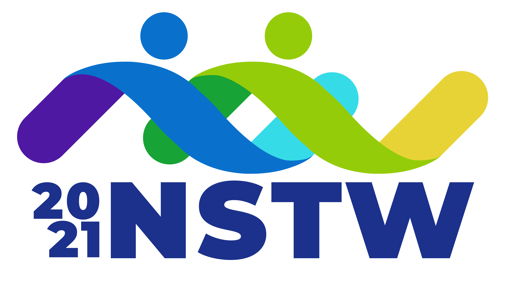
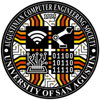

# DOST VI - Chatbot
### How to start
```bash
# Clone repository
git clone https://github.com/jasouza-git/dost_vi_chatbot
cd dost_vi_chatbot
# Fine-tune DOST Model (From Llama3 8B)
cd model
ollama create dost -f dost_chatbot.modelfile
cd ..
# Install dependencies
npm i
# Start app
npm start
```

<details>
  <summary><b>Introduction</b></summary>
  <h2>Organizers</h2>
  <table>
    <tr>
      <td></img></td>
      <td></img></td>
      <td></img></td>
      <td></img></td>
    </tr>
    <tr style="text-align:center">
      <td>DOST</td>
      <td>NSTW</td>
      <td>USA</td>
      <td>BSCPE</td>
    </tr>
  </table>
</details>
<details>
  <summary><b>Problems and Solutions</b></summary>
  <details>
    <summary><b>Current solutions to problems</b></summary>
    <table>
        <tr><th>Problem</th><th>Solution</th></tr>
        <tr><td>Individuals face difficulties finding DOST-relevant information scattered across multiple sources</td><td>By developing a chatbot for Facebook Messenger, the most widely used communication platform in the Philippines, we can centralize information access. This approach will reach a broader audience, including those with slower internet connections or limited technological skills, providing a single, comprehensive source of information.</td>
        <tr><td>The information available is not personalized or easily understood without additional explanation</td><td>The chatbot can be trained or integrated with DOST documents and information to address specific queries. It will provide tailored explanations and guide users through processes, reducing frustration and confusion while preventing missed opportunities.</td></tr>
        <tr><td>Not everyone speaks or understands English, particularly those who need help the most</td><td>By utilizing a multilingual language model, the chatbot can interact in various languages, making DOST processes, programs, scholarships, and services accessible to non-English speakers.</td></tr>
    </table>
  </details>
  <details>
    <summary><b>Future solutions to problems</b></summary>
    <table>
        <tr><th>Problem</th><th>Solution</th></tr>
        <tr><td>Individuals face difficulties finding DOST-relevant information scattered across multiple sources</td><td>By developing a chatbot for Facebook Messenger, the most widely used communication platform in the Philippines, we can centralize information access. This approach will reach a broader audience, including those with slower internet connections or limited technological skills, providing a single, comprehensive source of information.</td>
        <tr><td>The information available is not personalized or easily understood without additional explanation</td><td>The chatbot can be trained or integrated with DOST documents and information to address specific queries. It will provide tailored explanations and guide users through processes, reducing frustration and confusion while preventing missed opportunities.</td></tr>
        <tr><td>Not everyone speaks or understands English, particularly those who need help the most</td><td>By utilizing a multilingual language model, the chatbot can interact in various languages, making DOST processes, programs, scholarships, and services accessible to non-English speakers.</td></tr>
    </table>
  </details>
</details>
<details open>
  <summary><b>Technical Explaination</b></summary>
  <details>
    <summary><b>Stages of development</b></summary>
    <ol>
      <li>We first downloaded our dataset and convert them from PDF to images, markdowns, texts, etc. mostly locally though softwares like <code>pandoc</code> or <code>convert</code> so that we can later use them to train the model</li>
      <li>We downloaded <code>Ollama</code> and tested serveral pre-existing LLM/NLP to act has our base LLM to train our fine-tuined model like <code>Llama</code>, <code>Mistral</code>, and <code>Llava</code></li>
      <li>We trail and error different <code>modelfile</code>s on different LLM models and decided to stick to <code>LLama3 7b</code> for it was the most advance LLM/NLP we can host without it being too slow or dumb. This step of the process happened in parallel with the UI development because it took a long time to fine-tune it to our desired model</code>
      <li>The best platform to make this project was <code>Python</code> for it support in AI frameworks, <code>Javascript</code> for its adaptibility in most systems, and <code>C/C++</code> for its optimizations and efficency. Python is slow, limited interface<i>(tkinter)</i>, and lacked packability in different systems. C/C++ is good but would take alot of time thus not suited for our limited time range. Thus we picked Javascript, more specifically Node JS for its diversity in packages<i>(NPM)</i></li>
      <li>We created an <code>Electron</code> project to allow future packability in different systems especially servers</li>
      <li>We then created the interface in pure <code>HTML</code>, <code>JS</code>, and <code>CSS</code> for the electron to display</li>
      <li>We connected the interface to <code>Ollama</code> with our own custom model named <code>dost</code> to a chating interface</li>
      <li>We connected <code>Puppeteer</code> to control a facebook Page named <code>DOST-VI not legit</code> through the interface</li>
      <li>We finally compiled it to our desired platform in this case windows</li>
    </ol>
  </details>
  <details>
    <summary><b>Technologies used</b></summary>
    <table>
      <tr><th>Technology</th><th>Purpose</th><th>Reason</th></tr>
      <tr><td>Node JS</td><td>Main platform</td><td>Works best with the next following technologies then with python(slow), C++(hard), etc.</td></tr>
      <tr><td>Electron</td><td>Application engine</td><td>Makes packaging across platforms easier, albeit it bloated. Good for packaging the next following technologies</td></tr>
      <tr><td>Ollama</td><td>Large Language Model Manager</td><td>Allows training/deployment/management of LLM models easier</td></tr>
      <tr><td>Puppeteer</td><td>Automation and emulating APIs</td><td>APIs of services like Facebook, Instagram, etc. are not free so headless automating browsers allows us to use them for free</td></tr>
    </table>
  </details>
  <details>
    <summary><b>Challenges we faced</b></summary>
    <table>
      <tr><th>Challenge</th><th>Explaination/Solution</th></tr>
      <tr><td>Finding a good base LLM model</td><td>Instead of creating an LLM from scratch which would require huge amount of computative power and huge datasets which we cant have, we started with a base LLM model using <code>Ollama</code> to manage, eventually sticking on the <code>LLama3 7b</code> model. Any more advance LLM are too slow or too resource intensive</td></tr>
      <tr><td>Training our own custom model</td><td>To train or fine-tune the model on the dataset of four provided documents, we applied some LLM techniques like Chunking, Few Shot Learning, and Prompt engineering to enhance the efficiency and accuracy of the information that's retrieved and processed in the NLP. The hardest data set to train on was the RSTL services document because is was the largest among the four</td></tr>
      <tr><td>Graphical Designing</td><td>Since our groups consist primarly of Computer engineering students we lacked the human resources to design a good graphical user interface so we had to spend alot of time planning and trail and error a good looking interface. Resulting into a minimalistic simple interface</td></tr>
    </table>
  </details>
</details>


<style>
details{border-left:2px solid #fff5;margin-left:10px;margin-top:30px;padding-left:10px}
summary{position:relative;left:-15.5px;top:-20px;margin-bottom:-25px;}
</style>